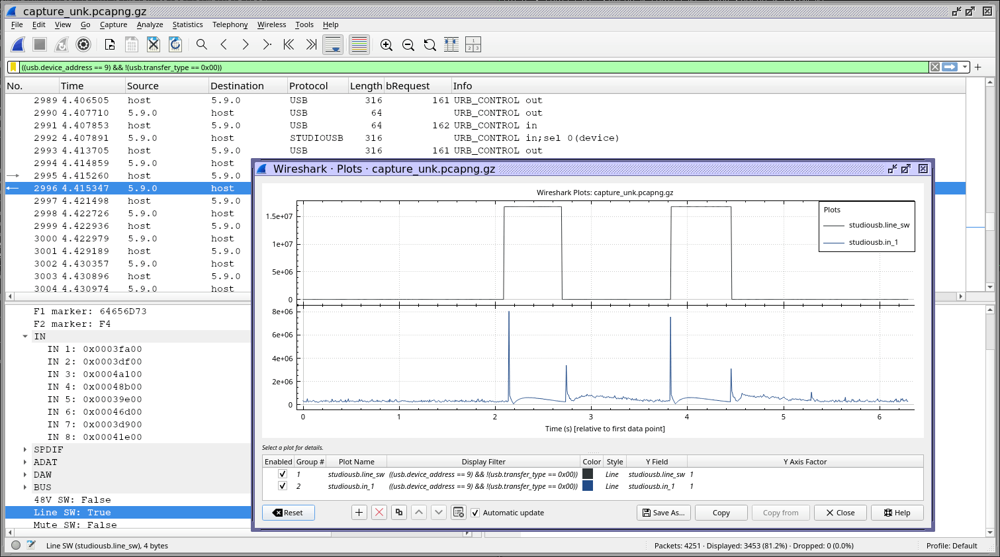

wireshark dissector for Presonus USB audio interfaces.

Initially for Studio 1824c, and probably also (with minor tweaks) all other devices supported by 
`studiousbdevice.dll` / `paestudiousbapi_x64.dll`
i.e.
```
"Studio 26" = VID_194F&PID_0104
"Studio 68" = VID_194F&PID_0105
"Studio 1810" = VID_194F&PID_0106
"Studio 1824" = VID_194F&PID_0107
"Studio 24" = VID_194F&PID_0108
"Studio 24c" = VID_194F&PID_0109
"Studio 26c" = VID_194F&PID_010A
"Studio 68c" = VID_194F&PID_010B
"Studio 1810c" = VID_194F&PID_010C
"Studio 1824c" = VID_194F&PID_010D
```

Based on info from
- https://git.kernel.org/pub/scm/linux/kernel/git/tiwai/sound.git/tree/sound/usb/mixer_s1810c.c
- https://github.com/royvegard/baton_studio/blob/main/src/lib.rs

Very much WIP, and could use some help; parsing USB in wireshark/lua is new to me.



